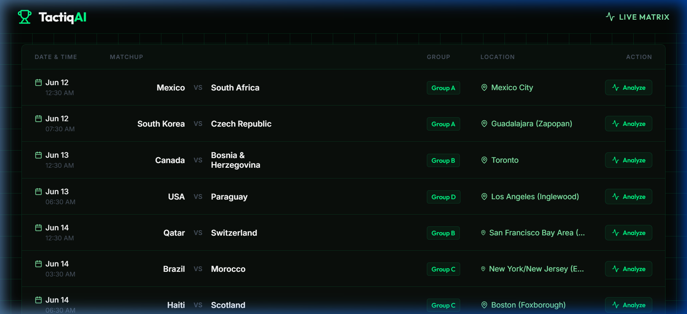

# TactiqAI: World Cup Analytics Engine

TactiqAI is an AI-powered tactical prediction engine built for the 2026 FIFA World Cup. It uses a custom **Two-Step AI Agent Architecture** powered by Google Gemini 2.5 Flash to combine static local data (venues, altitudes, team stats) with live web-scraped injury reports and squad news to generate highly accurate, structured match predictions.

 

## 🚀 Features

- **Agentic AI Pipeline:** 
  1. **The Researcher:** Autonomously browses the live web using Google Search tools to find real-time injury reports and squad updates for both teams.
  2. **The Analyst:** Takes the raw research notes and forces them into a strict Pydantic JSON schema to generate score predictions, key battles, and tactical verdicts.
- **Resilient Backend:** Built-in exponential backoff to handle API rate limits and `503 Unavailable` spikes from the Gemini LLM gracefully.
- **Premium Tactical UI:** A dark-mode, glassmorphic React frontend designed to look like a high-end sports data command center, complete with single-row data grids and animated win-probability bars.

## 🛠️ Tech Stack

### Backend
- **Framework:** FastAPI (Python)
- **AI Integration:** Google GenAI SDK (`gemini-2.5-flash`)
- **Data Validation:** Pydantic (Strict JSON generation)
- **Data Storage:** Flat JSON files (`fixtures.json`, `team_stats.json`, `venues.json`) loaded into memory via `lru_cache`.

### Frontend
- **Framework:** React + Vite
- **Styling:** Custom CSS (Dark Theme, Glassmorphism utilities)
- **Icons:** Lucide React

## ⚙️ Installation & Setup

### 1. Backend Setup
Navigate to the root directory and activate your virtual environment:
```bash
# Set your Gemini API Key
export GEMINI_API_KEY="your_api_key_here"  # On Windows use: set GEMINI_API_KEY="your_api_key"

# Install requirements (if you have a requirements.txt, otherwise pip install fastapi uvicorn google-genai)
# pip install -r requirements.txt

# Run the Uvicorn server
uvicorn backend.app.main:app --reload
```
*The backend will run on `http://127.0.0.1:8000`*

### 2. Frontend Setup
Open a new terminal and navigate to the frontend directory:
```bash
cd frontend
npm install
npm run dev
```
*The frontend will run on `http://localhost:5173`*

## 🧠 How the Data Works
1. `fetch_static_data.py` scrapes the raw `.txt` files from the OpenFootball GitHub repository.
2. `fetch_venue_data.py` uses Gemini to enrich the venues with altitudes and climates.
3. When a user clicks "Analyze" on the frontend, the FastAPI backend sends the static venue data to Gemini, telling it to research live injuries and predict how the altitude and missing players will affect the tactical matchup.

## 🤝 Contributing
Feel free to fork this project, submit pull requests, or use this Two-Step AI architecture pattern for your own projects!
